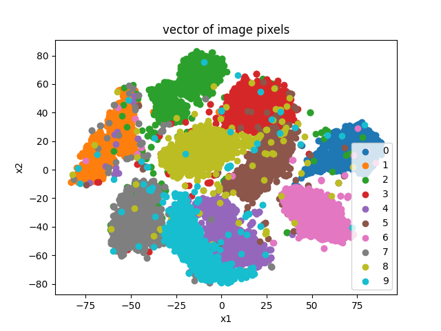
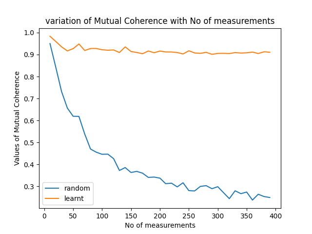

# Image Classification using Compressed Sensing

## Team Members - 
### Omkar Nitsure - https://github.com/omkarnitsureiitb
### Ojas Karanjkar - https://github.com/Ojas1905

## Overview
In this project, we do image classification on the **MNIST** dataset with **10** classes using compressive measurements. This involves sampling the image using a **sensing matrix** and then using the cluster centers computed on the training data to execute a kmeans-based algorithm to do final classification and achieve a classification accuracy of **75%**. We further learn this **sensing matrix** on the training data with the objective of maximizing the relative distance between the different cluster centers. This further increases the accuracy to **87%**. Then we add **random gaussian noise** and rotate the images by **random** angles in **0-360**. We implement the **GMLC** (smashed filter based) algorithm to first compute the most likely angle followed by the final classification. This gives an accuracy of about **70%**. We then imposed **sparsity** on the **DCT** coefficients by retaining only the **top k** values and were able to achieve an accuracy of . We then generated a video with **digits** in it and tested if our algorithm is able to classify in real time or not and it was able to classify the test images in a video with **30 fps** with an accuracy of **84%**.

## DCT coefficients and analysis

The following figure shows the clusters of **DCT coefficients** for the **10** classes. We also ran a simple **kmeans** algorithm on the clusters but the **test set** accuracy was only about **20**. This clearly is not a good accuracy and thus motivates the need for better methods for classification.

|             |
| :---------------------------------------: |
| Clusters of DCT coefficients for different classes on train split|

## Image and Feature clusters of measurements

The following **2** figures show the clusters formed by **image pixels** and only **390** measurements using a learnt **sensing matrix** with an objective of maximizing inter-cluster distance. We see that even after using only **50%** of the original size of the image we get almost the same information through smart choice of **sensing matrix**.

|  |         |
| :-------------------------------------------------: | :------------------------------------------: |
|                 Clusters of image pixels of the 10 classes                  | Measurement clusters using sensing matrix |

## Classification accuracy for 3 classes

We started out by doing image classification on **3** classes from the **MNIST** dataset by using the compressive measurements obtained through a random **sensing matrix**. We can see that the accuracy reaches to almost **95%** using number of measurements which are only about **7%** of number of pixels in the image. Following is the plot of classification accuracy Vs the number of measurements

|             |
| :---------------------------------------: |
| Classification accuracy Vs No of measurements for 3 classes|

## Manifold Cluster Center distances

Following is the plot of the **mean cluster centroid distance among different classes** as a function of number of measurements. We can see that the **inter-cluster** distance increases with more number of measurements which is a good sign as it suggests that having more and more measurements will help to improve classification accuracy. 

|             |
| :---------------------------------------: |
| Inter-centroid distance Vs No. of measurements|

## Classification using a random Sensing Matrix

We used a **sensing matrix** initialized by samples drawn from a **standard normal** distribution. Then used that matrix to do classification with all the **10** classes of the **MNIST** dataset. The following plot depicts the classification accuracy as a function of number of measurements.

|             |
| :---------------------------------------: |
| Inter-centroid distance Vs No. of measurements|

## Learning the Sensing matrix using data

After the elimentary experiments on random **sensing matrix**, we used data to learn the sensing matrix with the objective of **maximizing the inter-cluster distance** by defining a **kernel per class**. The exact mathematical formulation is as follows - 

1) The kernel function is defined as follows - 

$$
K_{c}(f_{\theta}(x), e_{c}) = \exp[-\frac{\frac{1}{n}||W_{c}f_{\theta}(x) - e_{c}||_{2}^{2}}{2\sigma^{2}}]
$$

2) The correct class label should have the largest kernel value. Thus, at test time the class label is evaluated as follows - 

$$
\arg \max_{c} K_{c}(f_{\theta}(x), e_{c})
$$

3) The sensing matrix was learnt to give the correct value of kernel function using the following objective of **binary cross entropy**- 

$$
L(x, y) = -\sum_{c}y_{c}\log (K_{c}) + (1 - y_{c})\log (1 - K_{c})
$$

## Classification accuracy  comparisons

We then compared the classification accuracy of both the **random** and **learnt** sensing matrix for a range of values of number of measurements ranging in **10-400**. We can see that the classification accuracy is consistently better for **learnt sensing matrix** than the **random sensing matrix**. Following plot depicts the results -

   

## Classification Accuracy after random rotations

We defined a function to rotate an input image by an angle **chosen randomly in 0-360** and then implemented **smashed filter based** GMLC algorithm for first computing the correct **angle of rotation** and then estimating the correct class. The same experiment was repeated for the learnt matrix. We can clearly see that once we take large enough samples, the classification accuracy for **random** sensing matrix is better than the **learnt** one. The plots are as follows - 

|             |
| :---------------------------------------: |
| Accuracy Vs no of samples|

## Classification Accuracy after adding noise

We added **random normal** noise to the data as no sensor will have perfect acquisition. We can see that the classification accuracy is better for the learnt phi even after adding a lot of noise. The results for various noise **variances** for both **random** and **learnt** sensing matrix are as follows - 

|  |         |
| :-------------------------------------------------: | :------------------------------------------: |
|                 random sensing matrix                  | learnt sensing matrix |

## Mutual Coherence values for sensing matrices

**Property of mutual coherence** of a matrix is defined as the **largest value of dot product between any 2 columns of a matrix**. Smaller value of coherence allows for good reconstruction of signals of larger values of sparsity. Thus we want the mutual coherence to be as small as possible. Here we can see that the coherence values are better for the **random** matrix and thus **randomly initialized** sensing matrix will do a better image reconstruction than the **learnt** one. Following plot compares the coherence values of both **random** and **learnt** matrix for different number of measurements - 

## Real time classification in video

We created a video of **12** randomly sampled images from the test split at a rate of **30 fps** and then used our model to predict the labels of digits being displayed in the video in real-time using both random and learnt sensing matrix. You can find the videos along with the predictions displayed on them in the **Videos** folder. The classification accuracies were as follows - 

1. Random sensing matrix - 9/12 correct predictions
2. Learnt sensing matrix - 10/12 correct predictions

